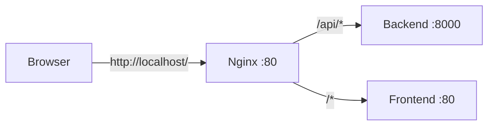

# 🔄 Configuración de API para Producción

## Variables de Entorno del Frontend

El frontend utiliza variables de entorno que se configuran en **tiempo de BUILD**, no en runtime.

### Archivos de Variables de Entorno

- `.env.development` - Usado en desarrollo local (`npm run dev`)
- `.env.production` - Usado en build de producción (`npm run build`)

### Variables Actuales

```env
# .env.production
VITE_API_URL=/api
VITE_API_VERSION=v1
VITE_TOKEN_KEY=auth_token
VITE_USER_KEY=user_info
```

## ✅ Cómo Funciona en Docker

### Desarrollo Local (Sin Docker)

```bash
cd analizador-gastos-front
npm run dev
```

El frontend se conecta directamente a `http://localhost:8000` (ver `.env.development`)

### Producción (Con Docker)



1. **Nginx principal** (puerto 80) recibe todas las peticiones
2. Rutas que empiezan con `/api/` se envían al backend
3. Otras rutas se envían al frontend (SPA)
4. El frontend usa `VITE_API_URL=/api` (relativo)

## 🔧 Configuración de Nginx

### Frontend (nginx.conf en analizador-gastos-front/)

```nginx
server {
    listen 80;
    root /usr/share/nginx/html;
    
    # SPA: todas las rutas van a index.html
    location / {
        try_files $uri $uri/ /index.html;
    }
}
```

### Reverse Proxy (nginx/nginx.conf)

```nginx
# API Backend
location /api/ {
    proxy_pass http://backend:8000;
}

# Frontend
location / {
    proxy_pass http://frontend:80;
}
```

## 📝 Cambios Necesarios en Código

### ✅ Ya Configurado

El archivo `src/services/api.ts` ya está configurado correctamente:

```typescript
const API_BASE_URL = import.meta.env.VITE_API_URL || 'http://localhost:8000';
const API_VERSION = import.meta.env.VITE_API_VERSION || 'v1';

export const apiClient = axios.create({
  baseURL: `${API_BASE_URL}/api/${API_VERSION}`,
  // ...
});
```

En producción: `baseURL = "/api/v1"` (relativo)
En desarrollo: `baseURL = "http://localhost:8000/api/v1"` (absoluto)

## 🚀 Build Process

### En Docker

```dockerfile
# Copiar .env.production
COPY .env.production .env

# Build (Vite lee las variables VITE_*)
RUN npm run build
```

Las variables se **embeben** en el código JavaScript durante el build.

### Local

```bash
# Development
npm run dev  # usa .env.development

# Production build
npm run build  # usa .env.production
npm run preview  # preview del build
```

## 🔍 Verificar Variables

```bash
# Ver qué variables usa Vite
grep -r "import.meta.env" src/

# En producción, las variables están en el código compilado
# No se pueden cambiar sin rebuild
```

## ⚠️ Importante

1. **Las variables VITE_* se configuran en BUILD TIME**
   - No se pueden cambiar sin reconstruir
   - Se embeben en el código JavaScript

2. **Para cambiar la URL del API en producción:**
   ```bash
   # Editar .env.production
   nano analizador-gastos-front/.env.production
   
   # Rebuild
   docker-compose build frontend
   docker-compose up -d frontend
   ```

3. **CORS debe permitir el dominio:**
   ```python
   # backend/app/main.py
   app.add_middleware(
       CORSMiddleware,
       allow_origins=["https://tudominio.com"],  # ← Cambiar en producción
       # ...
   )
   ```

## 🌐 Diferentes Escenarios

### Escenario 1: Todo en un VPS (Puerto 80)
```
Frontend: http://tudominio.com
Backend: http://tudominio.com/api
```

✅ Configuración actual funciona

### Escenario 2: Backend en subdomain
```
Frontend: https://app.tudominio.com
Backend: https://api.tudominio.com
```

Cambiar `.env.production`:
```env
VITE_API_URL=https://api.tudominio.com
```

### Escenario 3: Backend en otro servidor
```
Frontend: https://frontend-server.com
Backend: https://backend-server.com
```

Cambiar `.env.production`:
```env
VITE_API_URL=https://backend-server.com
```

Y configurar CORS en el backend.

## 📊 Testing

```bash
# Verificar que el frontend se conecta correctamente
docker-compose up -d

# Ver logs del frontend
docker-compose logs -f frontend

# Ver logs del backend
docker-compose logs -f backend

# Test desde browser console
fetch('/api/v1/health')
  .then(r => r.json())
  .then(console.log)
```

## 🔄 Actualizar Configuración

```bash
# 1. Editar variables
nano analizador-gastos-front/.env.production

# 2. Rebuild frontend
docker-compose build frontend

# 3. Reiniciar
docker-compose up -d frontend

# 4. Verificar logs
docker-compose logs -f frontend
```

## 📚 Referencias

- Vite Env Variables: https://vitejs.dev/guide/env-and-mode.html
- Nginx Proxy: http://nginx.org/en/docs/http/ngx_http_proxy_module.html
- Docker Compose: https://docs.docker.com/compose/
